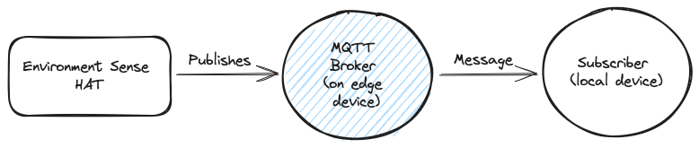

# environment-sensing

Collecting environment data from the [environment sense HAT](https://www.waveshare.com/environment-sensor-hat.htm) connected to a [reComputer J1010](https://www.seeedstudio.com/Jetson-10-1-A0-p-5336.html) edge AI device. The data is published to an MQTT broker (on the edge device) where it can be subcribed to and consumed by other applications and devices. Below is a diagram of the basic system architecture.

## Objectives

- [x] Collect environment data from the sense HAT in Python and C
- [x] Set up an MQTT broker on the edge device
- [x] Publish the data to the MQTT broker using `paho-mqtt`
- [x] Subscribe to the MQTT broker using `paho-mqtt` and retrieve the data
- [x] Use `msgspec` to perform typed decoding of the data
- [ ] Insert the data into a time series database (TimescaleDB)

## Project structure

...
